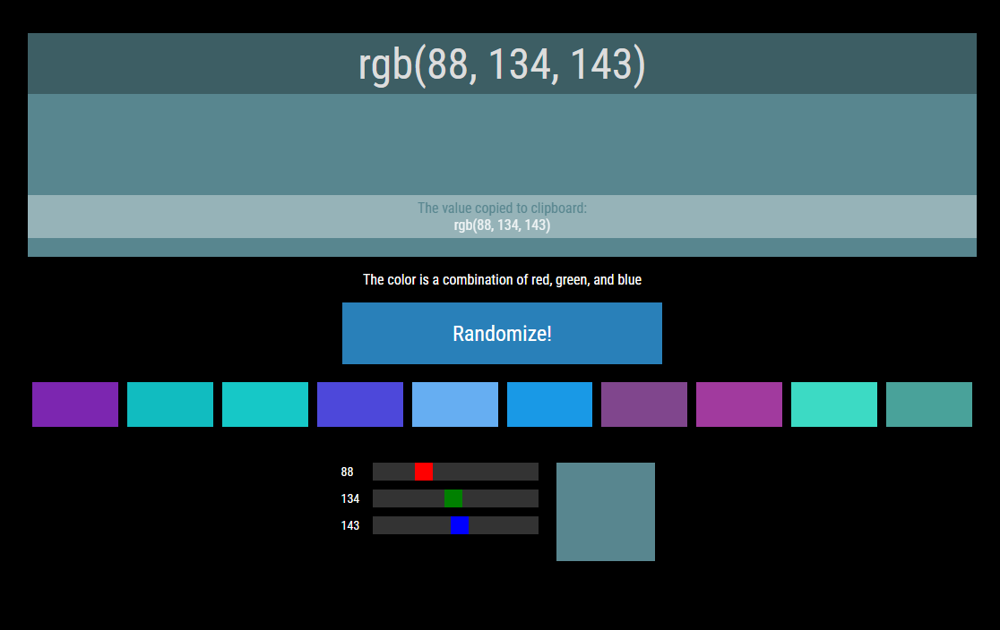

# Random RGB Color Generator
### Features:
- It generates random colors and gives you its RGB value `e.g., rgb(x, x, x)`.
- Copy the RGB value by clicking the big pane.
- Randomize the cards based on the RGB of the card you click.
- Minor adjustments can be made by using the sliders.
 
### Screenshot:

